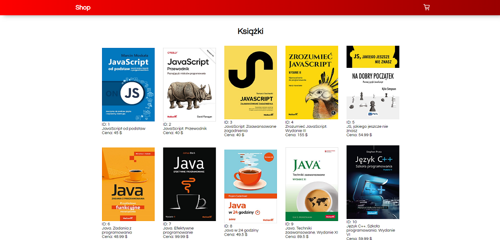
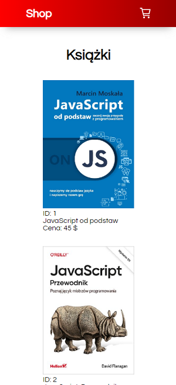

## Table of contents
* [General info](#general-info)
* [Technologies](#technologies)
* [Publishing production version](#publishing-production-version)
* [Screenshots](#screenshots)
* [Live](#live-star2)

## General info
E-commerce React Shop App

## Technologies
Project was created with:
* Vite

Used technologies & tools:
* JavaScript
* React
* styled-components
* react-icons

## Publishing production version

Use `npm run deploy` to publish a newest version on production

## Screenshots
* Desktop version :computer:   

 

* Mobile version :iphone:   

 

## Live :star2:
https://goldipl.github.io/e-commerce-react/